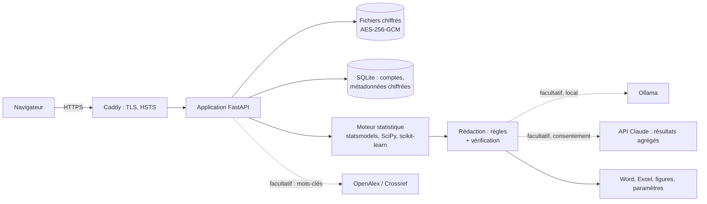

# Analyste académique

Application **locale et sécurisée** qui transforme un fichier de données en document académique : rapport de stage, rapport d'étude, mémoire, article scientifique ou note de synthèse. Elle choisit les méthodes statistiques adaptées, vérifie leurs conditions d'application, rédige les résultats en français académique et assemble un document Word structuré, avec ses tableaux, ses figures et sa bibliographie.

Vos données restent sur votre machine : elles sont chiffrées sur le disque, ne sont envoyées à aucun service, et sont détruites automatiquement après quelques jours.

## Ce que produit l'application

À partir d'un fichier CSV, Excel, SPSS ou Stata et de quelques informations sur votre étude :

| Étape | Contenu |
|---|---|
| Qualité des données | Valeurs manquantes, doublons, valeurs atypiques, modalités rares ; repérage et suppression des identifiants personnels |
| Descriptif | Effectifs, pourcentages et intervalles de confiance de Wilson ; moyennes, médianes, quartiles, normalité ; pondération possible |
| Bivarié | Choix automatique du test (khi-deux, Fisher, Monte-Carlo, t de Welch, Mann-Whitney, ANOVA, Welch, Kruskal-Wallis, Pearson, Spearman), taille d'effet (V de Cramér, d de Somers, d de Cohen, ω², ε²), comparaisons deux à deux, correction de Benjamini-Hochberg |
| Multivarié | Régression linéaire (erreurs robustes HC3), logistique binaire, multinomiale, ordonnée (test de Brant), Poisson ou binomiale négative ; associations brutes et ajustées ; modèles emboîtés par blocs ; diagnostics complets (Hosmer-Lemeshow, ROC, VIF, Breusch-Pagan, RESET…) |
| Multi-niveaux | Démarche par étapes M0 → M1 → M2 (→ M3 pente aléatoire) ; variance contextuelle, coefficient de partition de la variance, rapport de cotes médian ; logistique multi-niveaux par quadrature de Gauss-Hermite adaptative |
| Factoriel et typologie | ACP avec KMO, Bartlett et analyse parallèle de Horn ; ACM avec inertie corrigée de Benzécri ; classification de Ward avec silhouette et description des classes |
| Survie | Kaplan-Meier, log-rank, modèle de Cox avec test des risques proportionnels |
| Littérature | Recherche dans OpenAlex à partir de vos seuls mots-clés, regroupement thématique, tableaux de synthèse, références APA avec DOI |
| Document | Word avec page de garde, résumé, sommaire, listes des tableaux et graphiques, chapitres selon le type de document, bibliographie, annexes de reproductibilité ; classeur Excel de tous les tableaux ; figures ; paramètres JSON |

Les règles appliquées sont décrites dans le [guide méthodologique](docs/METHODOLOGIE.md).

### Rigueur avant tout

- **Aucun chiffre inventé.** Les résultats sont rédigés par des règles à partir des calculs. Si vous activez un modèle de langage, chaque paragraphe qu'il produit est vérifié : un nombre ou une référence absents des résultats, ou une formulation causale, entraînent le rejet du paragraphe.
- **Aucune référence inventée.** La bibliographie provient d'une bibliothèque méthodologique vérifiée (Benjamini et Hochberg, Hosmer et Lemeshow, Snijders et Bosker…) et des articles réellement trouvés dans OpenAlex.
- **Ce que l'application ne peut pas savoir, elle le dit.** Contexte de terrain, structure d'accueil, lecture critique de la littérature : ces passages sont surlignés « À compléter par l'auteur » dans le document.
- **Validation par simulation.** Les tests automatisés vérifient que les modèles retrouvent des paramètres connus sur des données simulées.

## Installation

### Option 1 : Docker (recommandée)

Prérequis : [Docker Desktop](https://www.docker.com/products/docker-desktop/) (Windows, macOS) ou Docker Engine (Linux).

```bash
git clone https://github.com/Wendyam-Ariel-Tiemtore/Projet_appli.git
cd Projet_appli
cp .env.example .env
docker compose up -d --build
```

Ouvrez **https://localhost**. Au premier lancement, créez le compte administrateur.

Le certificat est émis par une autorité locale propre à votre installation : le navigateur affiche un avertissement tant que vous ne lui faites pas confiance. Pour le supprimer, importez le certificat racine dans votre système :

```bash
docker compose cp proxy:/data/caddy/pki/authorities/local/root.crt ./autorite-locale.crt
```

puis double-cliquez sur `autorite-locale.crt` (Windows, macOS) ou copiez-le dans `/usr/local/share/ca-certificates/` et lancez `sudo update-ca-certificates` (Linux).

**Rédaction par un modèle local** (rien ne quitte la machine ; 16 Go de mémoire recommandés) :

```bash
docker compose --profile ia-locale up -d
docker compose exec ollama ollama pull qwen2.5:14b-instruct
```

### Option 2 : sans Docker

Prérequis : Python 3.11 ou plus récent.

```bash
git clone https://github.com/Wendyam-Ariel-Tiemtore/Projet_appli.git
cd Projet_appli
./scripts/lancer.sh            # Windows : powershell -ExecutionPolicy Bypass -File scripts\lancer.ps1
```

Ouvrez **https://localhost:8443**. Le script crée l'environnement Python, installe les dépendances et génère un certificat local.

### Essai sans interface

Pour voir un document complet produit sur des données fictives :

```bash
python scripts/generate_demo_data.py examples/enquete_demo.csv
python scripts/demo_run.py sortie_demo memoire
```

## Utilisation

1. **Déposer les données** : une ligne par observation, une colonne par variable, noms en première ligne.
2. **Vérifier les variables** : type (binaire, nominale, ordinale, continue, comptage), intitulé lisible, rôle (dépendante, explicative, contextuelle, identifiant du contexte, pondération, durée, événement), modalité de référence, blocs pour les modèles emboîtés.
3. **Préciser la demande** : type de document, page de garde, contexte, question de recherche, objectifs, hypothèses, mots-clés ; recherche bibliographique et mode de rédaction.
4. **Télécharger** le document Word, le classeur Excel, les figures et les paramètres de reproductibilité.

À l'ouverture du document dans Word, acceptez la mise à jour des champs pour générer le sommaire.

Questions fréquentes : [docs/FAQ.md](docs/FAQ.md).

## Confidentialité et sécurité

| Protection | Mise en œuvre |
|---|---|
| Transport | HTTPS obligatoire (Caddy, TLS 1.2+), HSTS |
| Comptes | Argon2id, mots de passe robustes, verrouillage après 5 échecs, sessions côté serveur (cookie `HttpOnly`, `Secure`, `SameSite=Strict`) |
| Requêtes | Jeton CSRF, contrôle de l'origine, CSP stricte sans script en ligne, en-têtes de sécurité |
| Fichiers déposés | Liste blanche, vérification de la signature réelle, refus des macros et des bombes de décompression |
| Données au repos | AES-256-GCM, une clé par projet enveloppée par une clé maîtresse ; effacement cryptographique |
| Cloisonnement | Chaque utilisateur ne voit que ses projets ; l'administrateur n'a pas accès aux données |
| Conservation | Purge automatique après 7 jours d'inactivité (configurable) |
| Conteneur | Utilisateur non privilégié, système de fichiers en lecture seule, capacités retirées |
| Chaîne logicielle | Dépendances épinglées, `pip-audit`, `bandit`, CodeQL, Dependabot |

Seuls deux échanges peuvent quitter la machine, et uniquement à votre demande : vos **mots-clés** vers OpenAlex pour la revue de littérature, et, si vous choisissez Claude et donnez votre consentement, des **résultats agrégés** vers l'API d'Anthropic pour la rédaction. Les données individuelles ne sont jamais transmises. Détails : [docs/CONFIDENTIALITE.md](docs/CONFIDENTIALITE.md) et [docs/SECURITE.md](docs/SECURITE.md).

## Configuration

Les réglages se font dans le fichier `.env` (voir [.env.example](.env.example)) : adresse et certificat, inscriptions libres, durée de conservation, taille maximale des fichiers, modèle local, clé et modèle Claude, autorisation des échanges externes. Le guide de déploiement sur serveur est dans [docs/DEPLOIEMENT.md](docs/DEPLOIEMENT.md).

**Sauvegardez la clé maîtresse** (volume `donnees`, fichier `secrets/cle_maitresse`) : sans elle, aucun projet ne peut être déchiffré.

## Architecture



Organisation du code :

```
analyste/
  stats/        lecture, typage, audit, descriptif, bivarié, modèles, multi-niveaux, factoriel, survie, figures
  literature/   OpenAlex et Crossref, synthèse thématique, références APA
  writing/      composition du document, fournisseurs de modèles, garde-fous de rédaction
  report/       génération Word et Excel
  security/     chiffrement, authentification, en-têtes, contrôle des fichiers
  web/          application, gabarits, feuille de style
docs/           méthodologie, FAQ, confidentialité, sécurité, déploiement
tests/          tests unitaires, statistiques par simulation, sécurité, parcours web complet
```

## Développement

```bash
python -m venv .venv && . .venv/bin/activate
pip install -r requirements-dev.txt
pytest -q                 # tests
ruff check .              # style
bandit -r analyste -c pyproject.toml
pip-audit -r requirements.txt
```

## Limites connues

- Pas d'inférence causale (variables instrumentales, appariement) ni de plan de sondage complexe complet dans les modèles.
- Analyse multi-niveaux à deux niveaux ; pente aléatoire en linéaire uniquement.
- Les parties propres à l'auteur (contexte, discussion critique, apport personnel) sont à compléter : c'est voulu.

## Intégrité académique

L'application automatise des calculs, une mise en forme et une partie de la rédaction. La démarche scientifique, la problématique et l'interprétation restent celles de l'auteur, qui vérifie chaque résultat et déclare l'usage de l'outil selon les règles de son institution. Une déclaration type figure en annexe de chaque document.

## Licence

[MIT](LICENSE), © 2026 Wendyam Ariel Tiemtoré.
